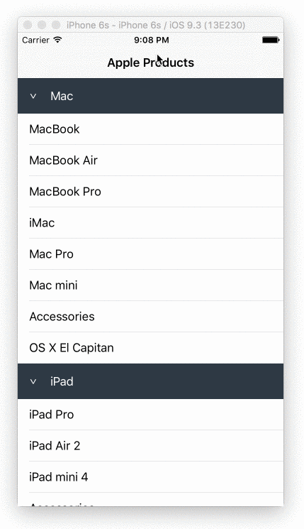

# How to Implement Collapsible Table Section in iOS

A simple iOS swift project demonstrates how to implement collapsible table section programmatically, that is no main storyboard, no XIB, no need to register nib, just purley Swift!

[]()

### Demo ###



### How to implement collapsible table sections? ###

#### Step 1. Prepare the Data ####

Let's say we have the following data that is grouped to different sections, each section is a `Section` object:

```swift
struct Section {
  var name: String!
  var items: [String]!
  var collapsed: Bool!
    
  init(name: String, items: [String], collapsed: Bool = false) {
    self.name = name
    self.items = items
    self.collapsed = collapsed
  }
}
    
var sections = [Section]()

sections = [
  Section(name: "Mac", items: ["MacBook", "MacBook Air", "MacBook Pro", "iMac", "Mac Pro", "Mac mini", "Accessories", "OS X El Capitan"]),
  Section(name: "iPad", items: ["iPad Pro", "iPad Air 2", "iPad mini 4", "Accessories"]),
  Section(name: "iPhone", items: ["iPhone 6s", "iPhone 6", "iPhone SE", "Accessories"])
]
```
`collapsed` indicates whether the current section is collapsed or not, by default is `false`.

#### Step 2. The Section Header ####

According to [Apple API reference](https://developer.apple.com/reference/uikit/uitableviewheaderfooterview), we should use `UITableViewHeaderFooterView`. Let's subclass it and implement the section header `CollapsibleTableViewHeader`:

```swift
class CollapsibleTableViewHeader: UITableViewHeaderFooterView {
    let titleLabel = UILabel()
    let arrowLabel = UILabel()
    
    override init(reuseIdentifier: String?) {
        super.init(reuseIdentifier: reuseIdentifier)
        
        contentView.addSubview(titleLabel)
        contentView.addSubview(arrowLabel)
    }
    
    required init?(coder aDecoder: NSCoder) {
        fatalError("init(coder:) has not been implemented")
    }
}
```

We need to collapse or expand the section when user taps on the header, to achieve this, let's borrow `UITapGestureRecognizer`. Also we need to delegate this event to the table view to update the `collapsed` property.

```swift
protocol CollapsibleTableViewHeaderDelegate {
    func toggleSection(header: CollapsibleTableViewHeader, section: Int)
}

class CollapsibleTableViewHeader: UITableViewHeaderFooterView {
    var delegate: CollapsibleTableViewHeaderDelegate?
    var section: Int = 0
    ...
    override init(reuseIdentifier: String?) {
        super.init(reuseIdentifier: reuseIdentifier)
        ...
        addGestureRecognizer(UITapGestureRecognizer(target: self, action: #selector(CollapsibleTableViewHeader.tapHeader(_:))))
    }
    ...
    func tapHeader(gestureRecognizer: UITapGestureRecognizer) {
        guard let cell = gestureRecognizer.view as? CollapsibleTableViewHeader else {
            return
        }
        delegate?.toggleSection(self, section: cell.section)
    }
    
    func setCollapsed(collapsed: Bool) {
        // Animate the arrow rotation (see Extensions.swf)
        arrowLabel.rotate(collapsed ? 0.0 : CGFloat(M_PI_2))
    }
}
```

Since we are not using any storyboard or XIB, how to do auto layout programmatically? The answer is `NSLayoutConstraint`'s `constraintsWithVisualFormat` function.

```swift
override init(reuseIdentifier: String?) {
    ...
    // arrowLabel must have fixed width and height
    arrowLabel.widthAnchor.constraintEqualToConstant(12).active = true
    arrowLabel.heightAnchor.constraintEqualToConstant(12).active = true
    
    titleLabel.translatesAutoresizingMaskIntoConstraints = false
    arrowLabel.translatesAutoresizingMaskIntoConstraints = false
}

override func layoutSubviews() {
    super.layoutSubviews()
    ...
    let views = [
        "titleLabel" : titleLabel,
        "arrowLabel" : arrowLabel,
    ]

    contentView.addConstraints(NSLayoutConstraint.constraintsWithVisualFormat(
        "H:|-20-[titleLabel]-[arrowLabel]-20-|",
        options: [],
        metrics: nil,
        views: views
    ))

    contentView.addConstraints(NSLayoutConstraint.constraintsWithVisualFormat(
        "V:|-[titleLabel]-|",
        options: [],
        metrics: nil,
        views: views
    ))

    contentView.addConstraints(NSLayoutConstraint.constraintsWithVisualFormat(
        "V:|-[arrowLabel]-|",
        options: [],
        metrics: nil,
        views: views
    ))
}
```

#### Step 3. The UITableView DataSource and Delegate ####

The number of sections is `sections.count`:

```swift
override func numberOfSectionsInTableView(tableView: UITableView) -> Int {
  return sections.count
}
```

and the number of rows in each section is:

```swift
override func tableView(tableView: UITableView, numberOfRowsInSection section: Int) -> Int {
    return sections[section].items.count
}
```

We use tableView's viewForHeaderInSection function to hook up our custom header:

```swift
override func tableView(tableView: UITableView, viewForHeaderInSection section: Int) -> UIView? {
    let header = tableView.dequeueReusableHeaderFooterViewWithIdentifier("header") as? CollapsibleTableViewHeader ?? CollapsibleTableViewHeader(reuseIdentifier: "header")

    header.titleLabel.text = sections[section].name
    header.arrowLabel.text = ">"
    header.setCollapsed(sections[section].collapsed)

    header.section = section
    header.delegate = self

    return header
}
```

The normal row cell is pretty straightforward:

```swift
override func tableView(tableView: UITableView, cellForRowAtIndexPath indexPath: NSIndexPath) -> UITableViewCell {
    let cell = tableView.dequeueReusableCellWithIdentifier("cell") as UITableViewCell? ?? UITableViewCell(style: .Default, reuseIdentifier: "cell")

    cell.textLabel?.text = sections[indexPath.section].items[indexPath.row]

    return cell
}
```

#### Step 4. How to Toggle Collapse and Expand ####

The idea is really simple, if a section's `collapsed` property is `true`, we set the height of the rows inside that section to be `0`, otherwise `44.0`!

```swift
override func tableView(tableView: UITableView, heightForRowAtIndexPath indexPath: NSIndexPath) -> CGFloat {
    return sections[indexPath.section].collapsed! ? 0 : 44.0
}
```

And here is the toggle function:

```swift
extension CollapsibleTableViewController: CollapsibleTableViewHeaderDelegate {
    func toggleSection(header: CollapsibleTableViewHeader, section: Int) {
        let collapsed = !sections[section].collapsed
        
        // Toggle collapse
        sections[section].collapsed = collapsed
        header.setCollapsed(collapsed)
        
        // Adjust the height of the rows inside the section
        tableView.beginUpdates()
        for i in 0 ..< sections[section].items.count {
            tableView.reloadRowsAtIndexPaths([NSIndexPath(forRow: i, inSection: section)], withRowAnimation: .Automatic)
        }
        tableView.endUpdates()
    }
}
```

Noticed that we don't lazily just reload the whole section, we only reload the rows inside that section, so that we won't see the refresh of the section header, and most importantly it will allow us to animate anything in the section header smoothly, i.e., rotate the arrow label, change the background etc.

That's it, please refer to the source code and see the detailed implementation.

### More Collapsible Demo ###

Sometimes you might want to implement the collapsible cells in a grouped-style table, I have a separate demo at [https://github.com/jeantimex/ios-swift-collapsible-table-section-in-grouped-section](https://github.com/jeantimex/ios-swift-collapsible-table-section-in-grouped-section). The implementation is pretty much the same but slightly different.

<br />

Author: Yong Su @ Box Inc.
